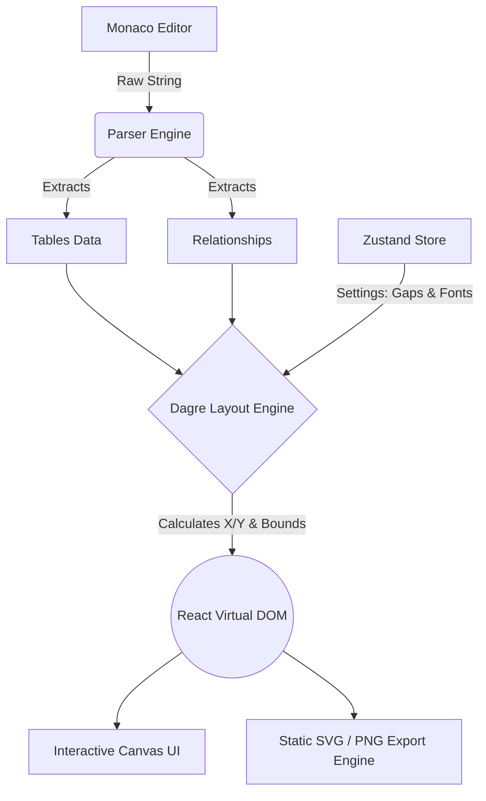

<div align="center">
  <div style="padding: 1.5rem; background: rgba(124, 58, 237, 0.1); border-radius: 9999px; display: inline-block; margin-bottom: 1rem;">
    <svg xmlns="http://www.w3.org/2000/svg" width="48" height="48" viewBox="0 0 24 24" fill="none" stroke="#7c3aed" stroke-width="2" stroke-linecap="round" stroke-linejoin="round"><ellipse cx="12" cy="5" rx="9" ry="3"/><path d="M3 5V19A9 3 0 0 0 21 19V5"/><path d="M3 12A9 3 0 0 0 21 12"/></svg>
  </div>
  <h1>Schema Canvas</h1>
  <p><strong>A lightning-fast, beautifully designed, code-to-diagram ERD tool.</strong></p>
</div>

---

Schema Canvas is a modern, Material You-styled web application that compiles a custom Domain Specific Language (DSL) into a stunning, interactive Entity Relationship Diagram (ERD) in real-time. 

## ✨ Key Features

- **Real-Time Rendering**: Type your schema and watch the visual graph compile and route itself instantly using the powerful Dagre layout engine.
- **Material You Aesthetic**: Built with dynamic, tonal surface colors and pill-shaped interactive elements that feel native, responsive, and incredibly premium.
- **Dynamic Theming**: Flawless Light, Dark, and System theme synchronization.
- **Deep Customization**: Adjust horizontal/vertical gaps, toggle Bezier vs. Orthogonal paths, customize font families (Inter, Roboto, Fira Code, Outfit), and tweak corner radii on the fly.
- **Flawless Export Engine**: Export your diagrams directly to high-res `PNG` or crisp `SVG` with all of your custom canvas settings perfectly preserved.
- **URL Serialization**: Share your schema *and* your layout settings instantly via compressed URL payloads!

---

## 📖 The Schema DSL

The syntax is designed to be as minimal and intuitive as possible.

### 1. Defining Tables
Tables are defined by their name, optional metadata inside brackets `[]`, and a block of fields.

```ts
tableName [icon: database, color: purple] {
  id string pk
  username string
  createdAt timestamp
}
```

> [!NOTE]  
> **Metadata Options**
> - `icon`: Use any valid [Lucide-React](https://lucide.dev/icons/) icon name (e.g., `user`, `shield`, `building`).
> - `color`: Use standard hex codes (`#123456`) or built-in named colors (`blue`, `red`, `purple`, `green`, `orange`).
> - `pk`: Append `pk` after a field type to visually flag it as a Primary Key!

### 2. Defining Relationships
Connect fields across tables using intuitive arrow operators outside of the table blocks:

- `table1.id <> table2.ref` &rarr; **Many-to-Many**
- `table1.id > table2.ref` &rarr; **One-to-Many**
- `table1.id < table2.ref` &rarr; **Many-to-One**
- `table1.id - table2.ref` &rarr; **One-to-One**

### Example Schema
```text
users [icon: user, color: blue] {
  id string pk
  fullName string
}

roles [icon: shield, color: purple] {
  id string pk
  name string
}

user_roles [icon: users, color: purple] {
  userId string
  roleId string
}

users.id <> user_roles.userId
roles.id <> user_roles.roleId
```

---

## 🔗 URL Serialization (Sharing)

When you click the **Share** button, Schema Canvas does not just save your code. It serializes both your schema and your active visual settings into a highly compressed URL hash using `lz-string`.

### The Data Payload
The internal payload structure looks like this before compression:
```json
{
  "code": "users { id pk }",
  "settings": {
    "nodesep": 60,
    "ranksep": 250,
    "pathType": "bezier",
    "fontFamily": "'Inter', sans-serif",
    "borderRadius": "2rem"
  }
}
```
This ensures that whoever clicks your link sees the exact same layout, fonts, and gap spacing that you designed!

> [!TIP]
> **Legacy Support**: The engine gracefully falls back to parse old `#code=...` URLs, ensuring backward compatibility with any links generated prior to the v2.0 settings update.

---

## 🛠️ Architecture Workflow



---

## 🚀 Local Development

This application is bundled with [Vite](https://vite.dev) and powered by [Bun](https://bun.sh/).

1. **Install Dependencies**
   ```bash
   bun install
   ```

2. **Start the Dev Server**
   ```bash
   bun dev
   ```

3. **Build for Production**
   ```bash
   bun run build
   ```

> [!IMPORTANT]
> Because of how heavily this application relies on standard DOM layouts for text measurements, the `dagre` layout engine calculates dynamic bounding boxes recursively. Avoid directly mutating DOM `div` sizes via CSS without updating the `useAppStore` compilation logic!
